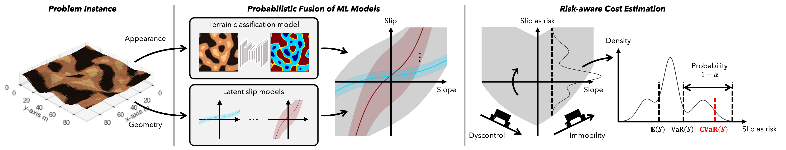

# Risk-aware Path Planning via Probabilistic Fusion of Traversability Prediction for Planetary Rovers on Heterogeneous Terrains (ICRA 2023)

This is a repository for the following paper:

- Masafumi Endo, Tatsunori Taniai, Ryo Yonetani, Genya Ishigami, "Risk-aware Path Planning via Probabilistic Fusion of Traversability Prediction for Planetary Rovers on Heterogeneous Terrains," IEEE ICRA, 2023. [[paper](https://arxiv.org/abs/2303.01169)] [[project page](https://omron-sinicx.github.io/safe-rover-navi/)] [[blog](https://medium.com/sinicx/risk-aware-path-planning-method-for-mobile-robots-in-planetary-environments-icra-2023-1cf42c29e380)]



We propose a novel path planning for safe rover navigation on heterogeneous deformable terrains, exploiting the uncertainty in ML-based traversability prediction. Our key idea is the probabilistic fusion of distinctive ML models while considering their uncertainties. This expression gives us a multimodal slip distribution accounting for heterogeneous terrains and further allows statistical risk assessment to derive risk-aware traversing costs for path planning.  


## Overview

- This repository provides a code to run our algorithm in your environment and reproduce the experiments in our ICRA paper.
- Please visit planning datasets repository when prepared data is necessary. Otherwise, you can produce datasets by running `./scripts/create_data.py`.

## Getting started
The code has been tested on Ubuntu 18.04.6 LTS with Python 3.9.10. Planning is performed on the CPU and the use of GPUs is skupported for training/evaluating terrain classifier.

### Create environment 
- Create a virtual environment and install all the necessary libraries.

```
$ python -m venv .venv
$ source .venv/bin/activate
(.venv) $ pip install -e .
```

### Run path planning using pretrained ML models
- Go to `./notebooks/demo.ipynb` to see example demonstration of traversability prediction and path planning.

### Reproduce experimental results
- Execute the following command to reproduce experimental results against various datasets.

```
(.venv) $ python scripts/eval.py
```
Note that you need to specify the name of datasets, such as `Std`, `ES`, or `AA`.

### Train ML models using datasets
- Execute the following command to train terrain classifiers after you download or produce datasets.

```
(.venv) $ python scripts/train.py
```
Note that you need to specify the name of datasets, such as `Std`, `ES`, or `AA`. The models for `Std` and `ES` datasets should be identical since their only difference is difficulty of predicting latent slip functions.